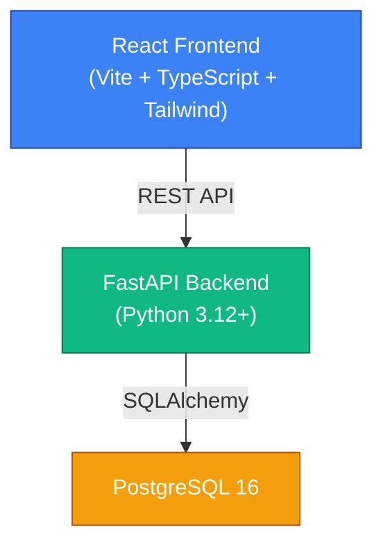

# Cyber Risk Platform

**AI-Powered Cyber Risk Quantification & Decision Intelligence Platform**

- [x] **Module 12 — Executive Cyber Risk & Decision Intelligence Dashboard**

An enterprise platform that continuously quantifies cyber risk in financial terms by combining security telemetry, asset criticality, vulnerabilities, threat intelligence, AI/ML prediction, and compliance mapping for NIST, ISO 27001, RBI, and SEBI.

## Current Status

> **Module 01 — Project Foundation** ✅

## Planned Modules

| # | Module | Status |
|---|--------|--------|
| 01 | Project Foundation | ✅ Complete |
| 02 | Database & Data Models | 🔲 Planned |
| 03 | Asset Management | 🔲 Planned |
| 04 | Security Telemetry | 🔲 Planned |
| 05 | Threat Intelligence | 🔲 Planned |
| 06 | Cyber Risk Engine | 🔲 Planned |
| 07 | Financial Risk Engine | ✅ Complete |
| 08 | AI Prediction Engine | ✅ Complete |
| 09 | Recommendation Engine | ✅ Complete |
| 10 | Budget Optimization & Scenario Simulation | ✅ Complete |
| 11 | Compliance Engine | 🔲 Planned |
| 12 | Executive Dashboard | 🔲 Planned |

## Technology Stack

| Layer | Technology |
|-------|-----------|
| Frontend | React, TypeScript, Vite, Tailwind CSS |
| Backend | Python 3.12+, FastAPI, Pydantic |
| Database | PostgreSQL 16 |
| ORM | SQLAlchemy 2.0 |
| Migrations | Alembic |
| Containerization | Docker, Docker Compose |

## Architecture



Future engines (Risk, AI/ML, Compliance, Recommendation, Budget Optimization, Scenario Simulation) will connect through well-defined service interfaces. See [Architecture Documentation](docs/architecture/system-architecture.md) for the full target architecture.

## Local Development

### Prerequisites

- [Docker](https://docs.docker.com/get-docker/) & Docker Compose
- [Node.js 20+](https://nodejs.org/) (for frontend development outside Docker)
- [Python 3.12+](https://python.org/) (for backend development outside Docker)

### Quick Start (Docker)

```bash
# Clone the repository
git clone <repo-url>
cd cyber-risk-platform

# Start all services
docker compose up --build
```

### Quick Start (Manual)

```bash
# Backend
cd backend
python -m venv .venv
.venv\Scripts\activate          # Windows
# source .venv/bin/activate     # Linux/macOS
pip install -r requirements.txt
uvicorn app.main:app --reload --host 0.0.0.0 --port 8000

# Frontend (in a separate terminal)
cd frontend
npm install
npm run dev
```

### Access Points

| Service | URL |
|---------|-----|
| Frontend | http://localhost:5173 |
| Backend API | http://localhost:8000 |
| API Documentation (Swagger) | http://localhost:8000/docs |
| API Documentation (ReDoc) | http://localhost:8000/redoc |
| Health Check | http://localhost:8000/api/v1/health |

### Development Commands

Using `make` (Linux/macOS) or run the commands directly (Windows PowerShell):

| Command | Description |
|---------|-------------|
| `make install` | Install backend & frontend dependencies |
| `make dev` | Start development servers |
| `make test` | Run backend tests |
| `make lint` | Run linters |
| `make format` | Auto-format code |
| `make docker-up` | Start Docker Compose services |
| `make docker-down` | Stop Docker Compose services |
| `make docker-build` | Build and start services |

**PowerShell equivalents:**

```powershell
# Install
cd backend; pip install -r requirements.txt; cd ..\frontend; npm install; cd ..

# Test
cd backend; python -m pytest tests/ -v; cd ..

# Lint
cd backend; ruff check .; black --check .; cd ..
cd frontend; npx eslint src/; cd ..

# Docker
docker compose up --build -d
docker compose down
```

### Running Tests

```bash
cd backend
python -m pytest tests/ -v
```

### Running Migrations

```bash
cd backend
alembic upgrade head       # Apply all migrations
alembic revision --autogenerate -m "description"  # Create new migration
```

## Project Structure

```
cyber-risk-platform/
├── frontend/          # React + TypeScript + Vite + Tailwind
├── backend/           # FastAPI + SQLAlchemy + Alembic
├── docs/              # Architecture and design documentation
├── risk-engine/       # 🔲 Cyber risk quantification engine
├── ai-engine/         # 🔲 AI/ML prediction engine
├── recommendation-engine/  # 🔲 Mitigation recommendations
├── optimization-engine/    # 🔲 Budget optimization
├── simulation-engine/      # 🔲 Attack scenario simulation
├── compliance-engine/      # 🔲 NIST/ISO/RBI/SEBI compliance
├── data-ingestion/    # 🔲 Security data ingestion
├── datasets/          # 🔲 Sample/test datasets
└── scripts/           # 🔲 Utility scripts
```

## Security

This project follows secure development practices:

- ✅ No hardcoded credentials
- ✅ `.env` excluded from version control
- ✅ CORS restricted to configured origins
- ✅ Global exception handler prevents internal error exposure
- ✅ Structured logging that never exposes sensitive data

**Production deployment will require:**

- HTTPS / TLS termination
- Proper secret management (e.g., HashiCorp Vault, AWS Secrets Manager)
- User authentication and authorization (JWT + RBAC)
- Database connection encryption
- Audit logging
- Network segmentation
- Regular security assessments

These will be implemented in later modules.

## License

Proprietary — All rights reserved.
