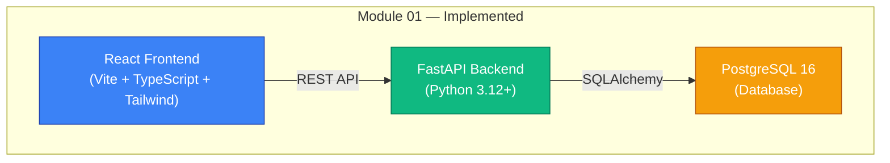
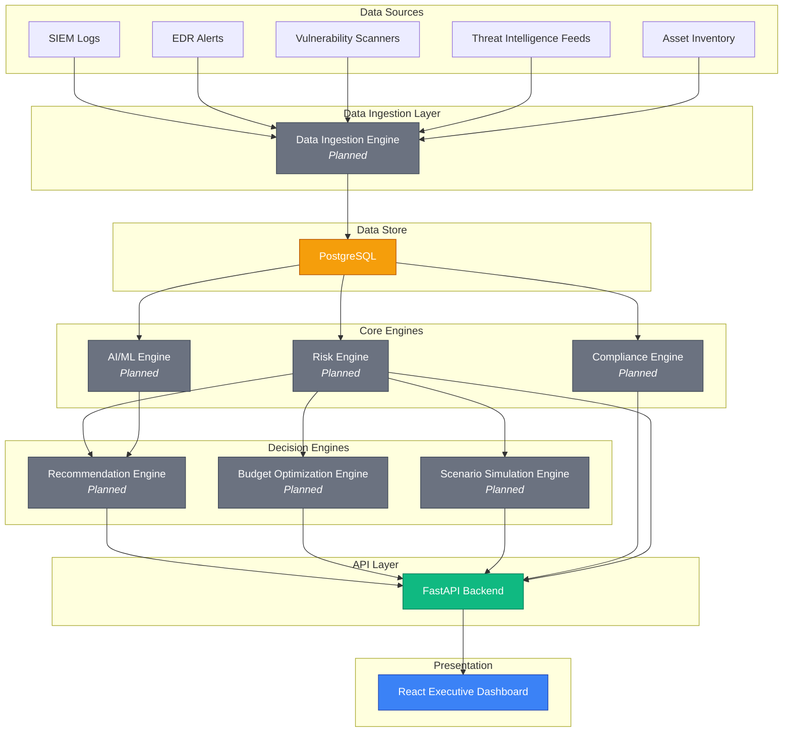

# System Architecture

## Overview

The **Cyber Risk Quantification & Decision Intelligence Platform** is designed as a modular monolith that can evolve into independent services as the system scales. The platform quantifies cyber risk in financial terms by combining security telemetry, asset criticality, vulnerabilities, threat intelligence, and AI/ML prediction.

## Current State (Module 01 — Foundation)

## Target Architecture (All Modules)

## Component Details

### Frontend (React + TypeScript + Vite + Tailwind CSS)

- **Status**: ✅ Foundation implemented
- Single-page application serving the executive dashboard
- Communicates with backend exclusively via REST API
- Environment-driven API base URL configuration
- Component-based architecture with common/shared components

### Backend (FastAPI + Python 3.12+)

- **Status**: ✅ Foundation implemented
- RESTful API with versioned endpoints (`/api/v1/...`)
- Pydantic for request/response validation and configuration
- SQLAlchemy ORM for database access
- Alembic for schema migrations
- Structured logging with security-safe defaults
- CORS configured per environment

### Database (PostgreSQL 16)

- **Status**: ✅ Foundation implemented
- Primary data store for all platform data
- Schema managed via Alembic migrations
- Future tables: Assets, Vulnerabilities, TelemetryEvents, Threats, Controls, RiskScores, Recommendations, Investments, Simulations, ComplianceControls

### Data Ingestion Engine

- **Status**: 🔲 Planned
- Normalize and ingest data from SIEM, EDR, vulnerability scanners, threat feeds
- Write structured data to PostgreSQL

### Risk Engine

- **Status**: 🔲 Planned
- Quantify cyber risk in financial terms
- Combine asset criticality, vulnerability severity, threat likelihood, control effectiveness

### AI/ML Engine

- **Status**: 🔲 Planned
- Predictive risk scoring using machine learning
- Anomaly detection on telemetry data
- Risk trend forecasting

### Compliance Engine

- **Status**: 🔲 Planned
- Map controls to frameworks: NIST CSF, ISO 27001, RBI, SEBI
- Track compliance posture and gaps

### Recommendation Engine

- **Status**: 🔲 Planned
- Generate actionable mitigation recommendations
- Prioritize by risk reduction per dollar spent

### Budget Optimization Engine

- **Status**: 🔲 Planned
- Optimize security investment allocation given a budget constraint
- Cost-benefit analysis of security controls

### Scenario Simulation Engine

- **Status**: 🔲 Planned
- Simulate cyber attack scenarios
- Model impact on risk posture and financial exposure

## API Versioning

All API endpoints are versioned under `/api/v1/`. Future breaking changes will introduce `/api/v2/`.

| Future Endpoint | Module |
|----------------|--------|
| `/api/v1/assets` | Asset Management |
| `/api/v1/telemetry` | Security Telemetry |
| `/api/v1/threats` | Threat Intelligence |
| `/api/v1/risks` | Risk Engine |
| `/api/v1/recommendations` | Recommendation Engine |
| `/api/v1/budget` | Budget Optimization |
| `/api/v1/simulations` | Scenario Simulation |
| `/api/v1/compliance` | Compliance Engine |

## Design Principles

1. **Modular Monolith** — Single deployable unit with clear module boundaries, designed to split into services later if needed.
2. **Clean Architecture** — Business logic in services, not in route handlers.
3. **Configuration-driven** — All environment-specific values loaded from environment variables.
4. **Security by default** — No secrets in code, restricted CORS, structured logging that never exposes sensitive data.
5. **Future-ready** — Directory structure and interfaces designed for AI/ML integration without restructuring.
