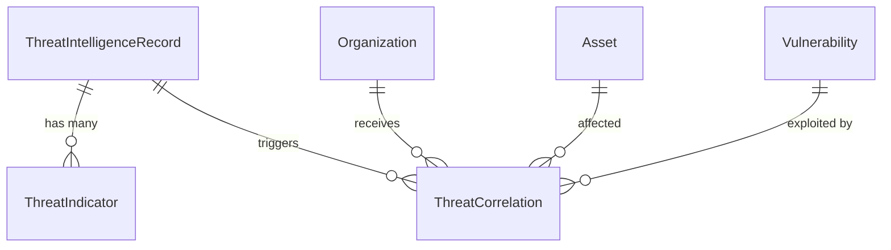

# Module 05: Threat Intelligence & Correlation

## Overview
Module 5 introduces global Threat Intelligence to the Cyber Risk Platform. It establishes a centralized repository for external threats (such as CVEs, Malware Campaigns, and Threat Actors) and maps them to internal Assets and Vulnerabilities using a Correlation Engine.

## Core Concepts

### 1. Global Intelligence vs Local Context
Unlike the `Threat` model from Module 2 (which is strictly tied to an `organization_id`), the new models are **global**. This prevents data duplication.
- `ThreatIntelligenceRecord`: Represents a CVE, Actor, or Campaign.
- `ThreatIndicator`: Represents an IOC (IP, domain, hash).

### 2. The Correlation Engine
The engine bridges the gap between global threats and local context via the `ThreatCorrelation` model.
- **CVE to Vulnerability Match**: If a tenant has a Vulnerability matching a CVE ID found in the Threat Intelligence, a correlation is created.
- **IOC to Telemetry Match**: If a tenant's Security Telemetry contains an IP or Domain found in a Threat Indicator, a correlation is created.

## Database Schema

## API Endpoints
- `GET /api/v1/threat-intelligence`: List paginated threats.
- `POST /api/v1/threat-intelligence`: Ingest new threat intelligence.
- `GET /api/v1/threat-intelligence/stats`: Retrieve dashboard analytics.
- `GET /api/v1/assets/{id}/threat-intelligence`: Retrieve threat correlations for a specific asset.

## Future Enhancements
In later modules (Module 6/7/8), this correlation layer will feed directly into the Risk Calculation Engine to dynamically adjust asset risk scores when a known exploited vulnerability is discovered in the intelligence feed.
